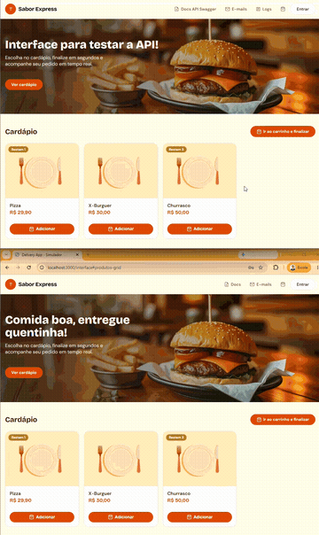

<p align="center">
  <a href="http://nestjs.com/" target="blank"></a>
</p>

[circleci-image]: https://img.shields.io/circleci/build/github/nestjs/nest/master?token=abc123def456
[circleci-url]: https://circleci.com/gh/nestjs/nest

  <p align="center">A progressive <a href="http://nodejs.org" target="_blank">Node.js</a> framework for building efficient and scalable server-side applications.</p>
    <p align="center">
<a href="https://www.npmjs.com/~nestjscore" target="_blank"></a>
<a href="https://www.npmjs.com/~nestjscore" target="_blank"></a>
<a href="https://www.npmjs.com/~nestjscore" target="_blank"></a>
<a href="https://circleci.com/gh/nestjs/nest" target="_blank"></a>
<a href="https://discord.gg/G7Qnnhy" target="_blank"></a>
<a href="https://opencollective.com/nest#backer" target="_blank"></a>
<a href="https://opencollective.com/nest#sponsor" target="_blank"></a>
  <a href="https://paypal.me/kamilmysliwiec" target="_blank"></a>
    <a href="https://opencollective.com/nest#sponsor"  target="_blank"></a>
  <a href="https://twitter.com/nestframework" target="_blank"></a>
</p>
  <!--[](https://opencollective.com/nest#backer)
  [](https://opencollective.com/nest#sponsor)-->

## Description

API de delivery construída com [Nest](https://github.com/nestjs/nest), [TypeORM](https://typeorm.io/) (PostgreSQL) e [Socket.IO](https://socket.io/), com uma interface web simples (Handlebars) para simular o fluxo de pedido de ponta a ponta.

### Funcionalidades

- **Autenticação e autorização** — cadastro/login de clientes com JWT, rota `me` autenticada e controle de acesso por papel (`ADMIN` / `CLIENTE`).
- **Clientes** — CRUD de clientes (ADMIN), com criação automática do cliente ao finalizar um pedido caso o e-mail ainda não exista.
- **Produtos** — CRUD de produtos com controle de estoque; listagem pública, criação/edição restritas ao ADMIN.
- **Pedidos** — criação pública de pedidos (com baixa de estoque), listagem com filtros por status/cliente/período, consulta pelos próprios pedidos (`/orders/me`) e atualização de status pelo ADMIN.
- **Rastreio público** — cada pedido recebe um token de rastreio único, permitindo consulta do status sem necessidade de login (`/orders/track/:token`).
- **Atualizações em tempo real** — WebSocket (`OrdersGateway`) que notifica o cliente e os admins assim que o status de um pedido muda, agrupando conexões em salas por cliente/pedido.
- **Notificações por e-mail** — envio automático de e-mails de confirmação de pedido e de mudança de status (via Nodemailer + templates Handlebars).
- **Interface de demonstração** — página web em `/interface` para simular todo o fluxo (cadastro, pedido, acompanhamento em tempo real).
- **Documentação da API** — Swagger disponível em `/swagger`.
- **Seed inicial** — criação automática do usuário administrador e dos status de pedido na subida da aplicação.
- **Ambiente de desenvolvimento via Docker** — API, PostgreSQL, Mailpit (caixa de e-mail de teste) e Dozzle (visualização de logs) orquestrados com `docker-compose`.

## Demonstração

GIF

<p align="center">
  
</p>

Vídeo em https://github.com/joao-vitor-meller/delivery-test/blob/master/src/web/midia/demo.mp4

<p align="center">
  <video src="src/web/midia/demo.mp4" controls width="480">
    Seu visualizador não suporta vídeo incorporado — baixe o arquivo em <a href="src/web/midia/demo.mp4">src/web/midia/demo.mp4</a>.
  </video>
</p>

## Executando com Docker

Pré-requisitos: Docker e Docker Compose instalados.

1. Copie o arquivo de variáveis de ambiente:

   ```bash
   $ cp .env.example .env
   ```

2. Suba os containers (API, banco Postgres, Mailpit e Dozzle):

   ```bash
   $ docker compose up --build
   ```

3. Após subir, os serviços ficam disponíveis em:

   | Serviço                            | URL                             |
   | ---------------------------------- | ------------------------------- |
   | API                                | http://localhost:3000           |
   | Interface para testes              | http://localhost:3000/interface |
   | Swagger (documentação da API)      | http://localhost:3000/swagger   |
   | Mailpit (caixa de e-mail de teste) | http://localhost:8025           |
   | Dozzle (logs dos containers)       | http://localhost:9999           |

   As portas podem ser customizadas através das variáveis `API_PORT`, `DOZZLE_PORT` e `POSTGRES_PORT` no `.env`.

   Abaixo, a arquitetura atual da API (API, Postgres, Mailpit e Dozzle) com os logs dos containers sendo acompanhados em tempo real pelo Dozzle:

   <p align="center">
     
   </p>

4. Para parar os containers:

   ```bash
   $ docker compose down
   ```

## Project setup (execução local, sem Docker)

```bash
$ npm install
```

## Compile and run the project

```bash
# development
$ npm run start

# watch mode
$ npm run start:dev

# production mode
$ npm run start:prod
```

## Run tests

```bash
# unit tests
$ npm run test

# e2e tests
$ npm run test:e2e

# test coverage
$ npm run test:cov
```

## Deployment

When you're ready to deploy your NestJS application to production, there are some key steps you can take to ensure it runs as efficiently as possible. Check out the [deployment documentation](https://docs.nestjs.com/deployment) for more information.

If you are looking for a cloud-based platform to deploy your NestJS application, check out [Mau](https://mau.nestjs.com), our official platform for deploying NestJS applications on AWS. Mau makes deployment straightforward and fast, requiring just a few simple steps:

```bash
$ npm install -g @nestjs/mau
$ mau deploy
```

With Mau, you can deploy your application in just a few clicks, allowing you to focus on building features rather than managing infrastructure.

## Resources

Check out a few resources that may come in handy when working with NestJS:

- Visit the [NestJS Documentation](https://docs.nestjs.com) to learn more about the framework.
- For questions and support, please visit our [Discord channel](https://discord.gg/G7Qnnhy).
- To dive deeper and get more hands-on experience, check out our official video [courses](https://courses.nestjs.com/).
- Deploy your application to AWS with the help of [NestJS Mau](https://mau.nestjs.com) in just a few clicks.
- Visualize your application graph and interact with the NestJS application in real-time using [NestJS Devtools](https://devtools.nestjs.com).
- Need help with your project (part-time to full-time)? Check out our official [enterprise support](https://enterprise.nestjs.com).
- To stay in the loop and get updates, follow us on [X](https://x.com/nestframework) and [LinkedIn](https://linkedin.com/company/nestjs).
- Looking for a job, or have a job to offer? Check out our official [Jobs board](https://jobs.nestjs.com).

## Support

Nest is an MIT-licensed open source project. It can grow thanks to the sponsors and support by the amazing backers. If you'd like to join them, please [read more here](https://docs.nestjs.com/support).

## Stay in touch

- Author - [Kamil Myśliwiec](https://twitter.com/kammysliwiec)
- Website - [https://nestjs.com](https://nestjs.com/)
- Twitter - [@nestframework](https://twitter.com/nestframework)

## License

Nest is [MIT licensed](https://github.com/nestjs/nest/blob/master/LICENSE).
